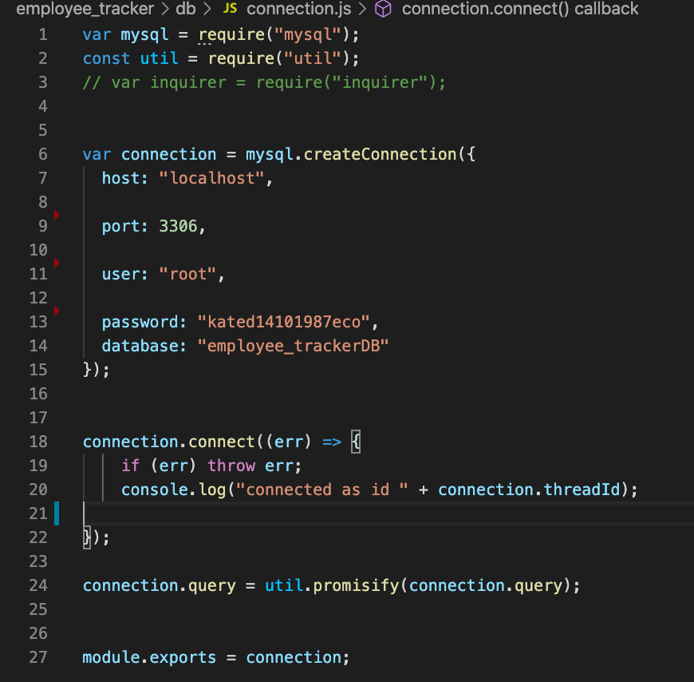
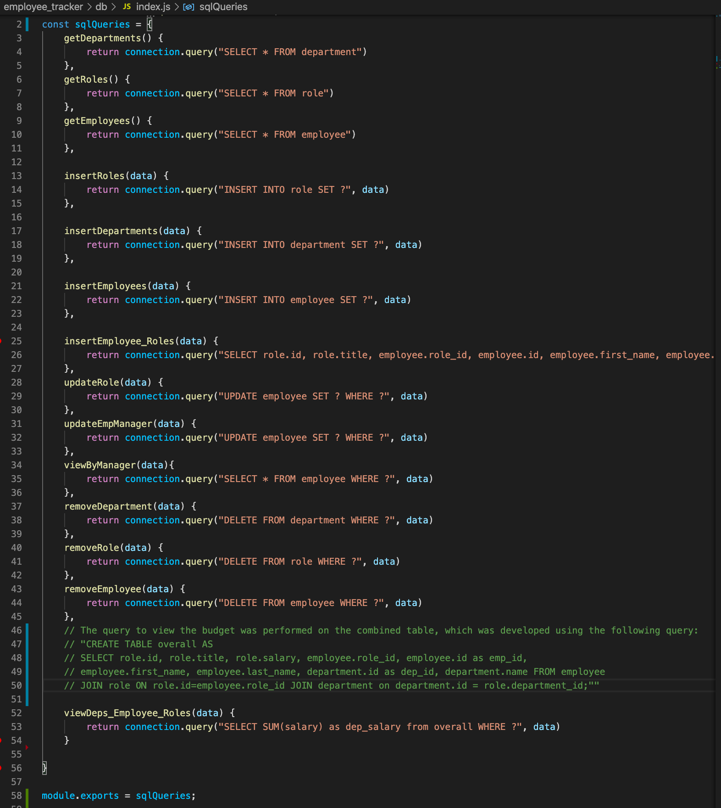
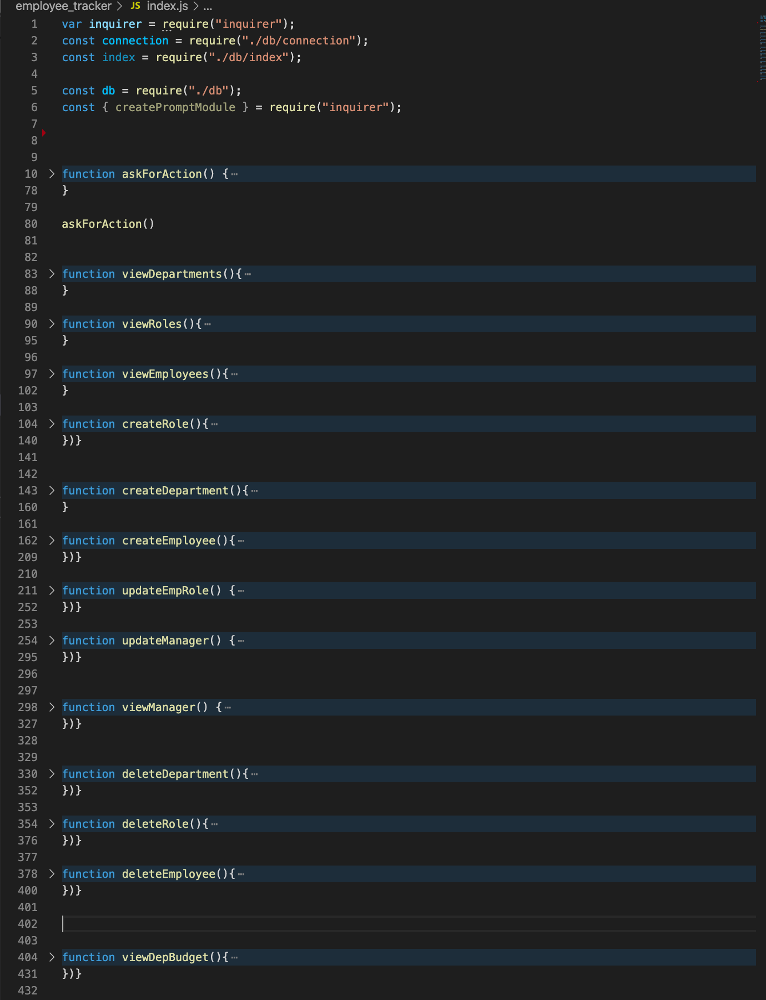
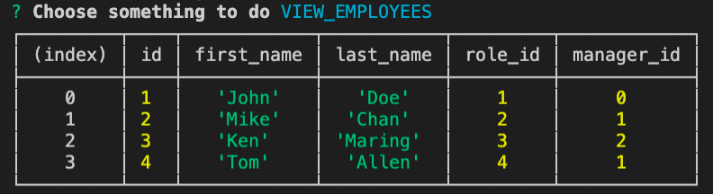
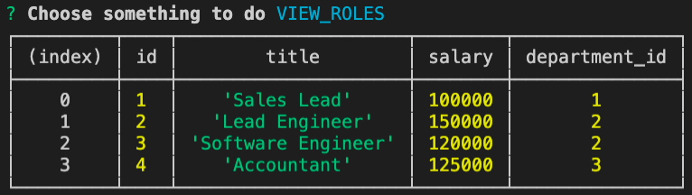
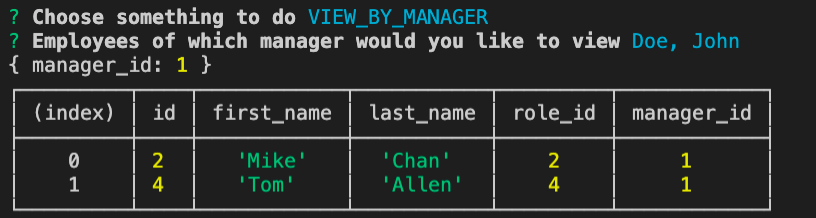
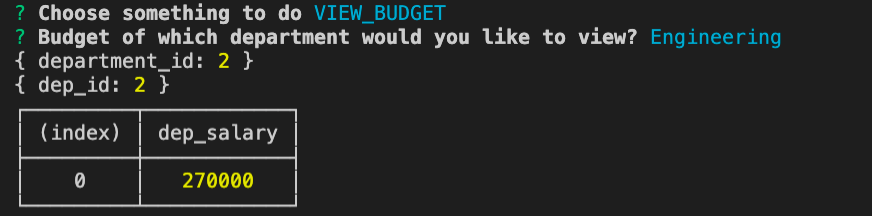

# Employee Tracking System 

## Table of Contents
1. [ Description ](#desc)
2. [ Task ](#task)
3. [ Link to screen recording ](#link)
4. [ Structure ](#structure)
5. [ Finished product ](#final)

## 1. Description
This repository contains code for the application that allows to manage a company's employees. 
The application allows the user to [erform the following actions:
* Add departments, roles, employees
* View departments, roles, employees
* Update employee roles
* Update employee managers
* View employees by manager
* Delete departments, roles, and employees
* View the total utilized budget of a department, i.e. the combined salaries of all employees in that department.

## 2. Task
Task is architect and build a solution for managing a company's employees using node, inquirer, and MySQL.
The database schema contains three tables: departments (stores department names and ids), roles (stores role ids, titles, salaries and department ids), and employees (stores ids, first and last name, role and manager's ids). The departments and roles tables are connected via the department id, while roles and employees tables are connected via role ids. The application asks the user for the sepcific action, such as to view, create, delete departments, roles, employees, update roles or managers, view budget or exit the application. Depending on the user's selection, they are either presented with the requested information or prompted for an (additional) input. MySQL NPM package  is used to connect to MySQL database and perform queries. InquirerJs NPM package is used to interact with the user via the command-line. Package console.table is used to print MySQL rows to the console.  

## 3. Link to screen recording
Screen recording capturing how the application is working is generated: 

## 4. Structure
The files containing the connection to MySQL database and SQL queries are separated from the main application file, and are located in a *db* folder. In addition to the mySQL database parameters, *connection.js* also contains *util.promisify* that allows to convert a regular function into an async function, i.e. a function that returns a promise. It is used to avoid messy promise chains and introduce a cleaner way to do asynchronous programming. 

*index.js* located in the *db* folder contains SQL queries required to extract information from the database. 

*index.js* located in the root folder contains the main functionality of the application that is represented by chaining inquirer requests and calls to SQL queries.

The database and the tables were developed in MySQL Workbench. The *seed.sql* file is provided for the reference.

## 5. Finished product
The recording showing the flow of the application is located in the *media* folder: [Link](./output/team.html).

Here is the output of the program that shows the employees:

Here is the output of the program that shows the roles:

Here is the output of the program that shows the employees by manager:

Here is the output of the program that shows the total utilized budget of a department:

